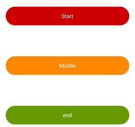
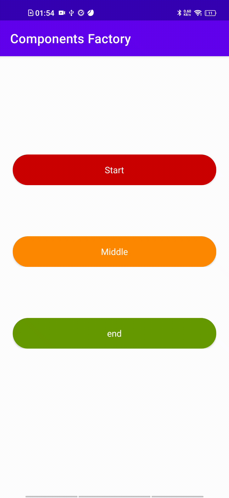
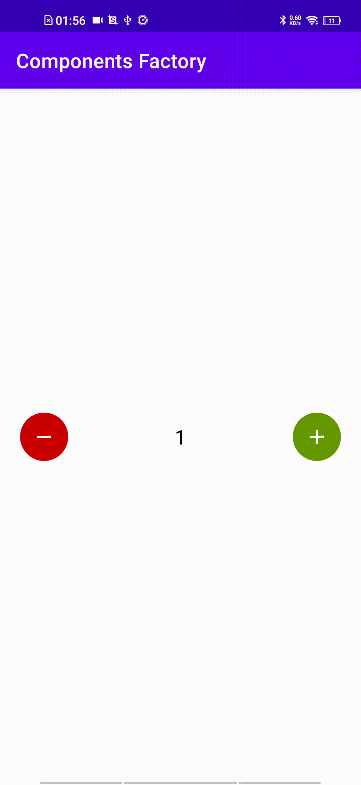

# Wings Components


A lightweight collection of **reusable Android UI components built with Kotlin**.

`Wings Components` helps developers integrate customizable and reusable UI widgets into Android applications quickly without rewriting common components.

---

# ✨ Features

• Reusable Android UI components
• Built completely in **Kotlin**
• Easy integration via **JitPack**
• Lightweight and modular
• Clean architecture and maintainable code

---

# 📦 Installation

This library is distributed via **JitPack**.

## Step 1 — Add JitPack repository

Add this to your **settings.gradle**

```
dependencyResolutionManagement {
    repositoriesMode.set(RepositoriesMode.FAIL_ON_PROJECT_REPOS)
    repositories {
        google()
        mavenCentral()
        maven { url 'https://jitpack.io' }
    }
}
```

---

## Step 2 — Add Dependency

Add this to your **module level build.gradle**

```
dependencies {
    implementation 'com.github.abhijeet64009:Wings-Components:1.1.01'
}
```

---

# 🧩 Available Components

| Component          | Description                                                          |
| ------------------ | -------------------------------------------------------------------- |
| **NumberPicker**   | A customizable number picker with increase and decrease buttons      |
| **ProgressButton** | A button that displays loading/progress state during long operations |

---

# 🚀 Usage Examples

## Number Picker

### XML

```
<com.satya.wingslibrary.WingsNumberPicker
   android:layout_width="match_parent"
   android:layout_height="wrap_content"
   app:wnpMin="0"
   app:wnpMax="10"
   app:wnpCount="1"
   app:wnpBtnSize="24dp"
   app:wnpTextSize="12sp"
   app:wnpDecTint="@color/red_600"
   app:wnpIncTint="@color/green_800"
   app:wnpDecIconTint="@color/white"
   app:wnpIncIconTint="@color/white"/>
```

### Kotlin

```
val numberPicker = WingsNumberPicker(context)
```

---

## Progress Button

### XML

```
<com.satya.wingslibrary.WingsProgressButton
   android:layout_width="match_parent"
   android:layout_height="match_parent"
   app:wpbColor="@android:color/holo_blue_dark"
   app:wpbText="Proceed"
   app:wpbDelay="1500"
   app:wpbExecuteAt="middle"
   app:wpbTextColor="@color/white"
   app:wpbRadius="24dp"
   app:wpbTextSize="16sp"/>
```

### Kotlin

```
val progressButton = WingsProgressButton(context)

progressButton.initiateClick()
progressButton.setDelayTime(500)  // Desired delay in ms
progressButton.setExecuteAt(end)  // start, middle, end for setOnButtonClick
progressButton.setOnButtonClick { desiredAction() }
```

---

# 📸 Component Previews

### Progress Button



### Number Picker


---

# 🎬 Demo

<table>
<tr>
<td align="center">
<b>Progress Button</b><br>

</td>
    
<td align="center">
<b>Number Picker</b><br>

</td>
</tr>
</table>

---

# 📁 Project Structure

```
Wings-Components
│
├── app                -> Demo application
├── wings-library      -> Core component library
│
└── Gradle build files
```

---

# 🛠 Future Plans

• More reusable UI components
• Material Design compatible widgets
• Jetpack Compose components
• Improved documentation and examples

---

# 🤝 Contributing

Contributions are welcome.

1. Fork the repository
2. Create a feature branch
3. Commit your changes
4. Submit a pull request

---

# 👨‍💻 Author

**Satyajeet Kashyap**

GitHub
https://github.com/abhijeet64009

---

# ⭐ Support

If you find this library useful, please **star ⭐ the repository**.
